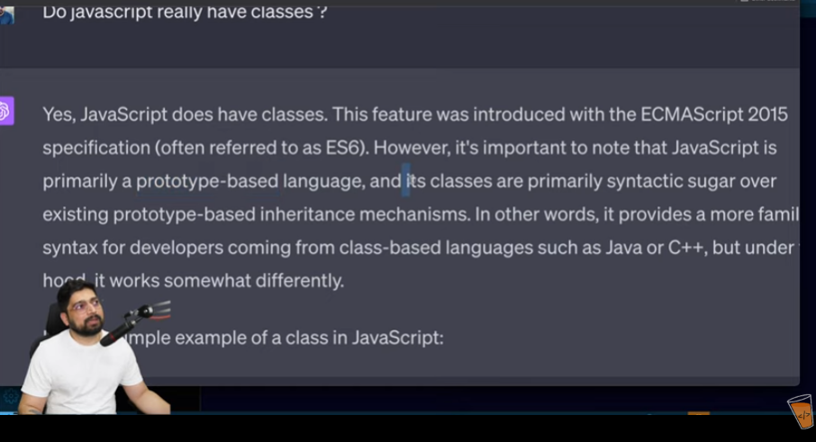
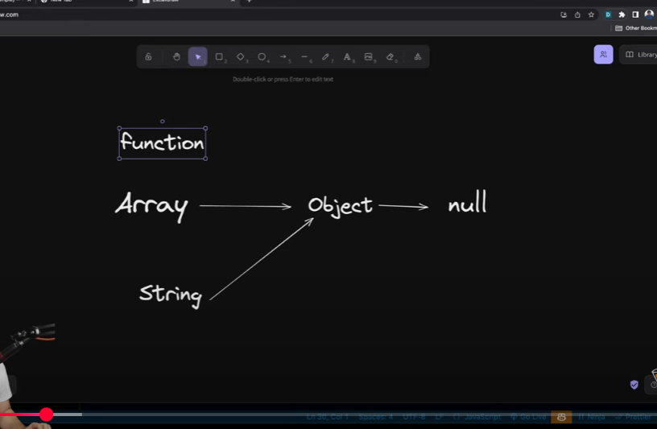

//Classes in js
//js mai classes nhi hoti //technically ni hoti

//OOP IS programmimg paradyme...means style of writing code 

##OBJECT
- colllecton of propertie and methods 
eg- toLowerCase etc

##why use OOP
-code boht messup ho rha tha bina oop k 
now we can make services using oop

##parts of OOP
OBJRCT LITERAL
CONSTRUCTOR FUNCTION 
PROTOTYPES 
Classes
Instances(new,this)
##four pillars of oop
Abstraction,
Encapsulation,  /means ek wrapper type ka bna do
Inheritance,
Polymorphism  //ek hi method kai kaam kar deta hai

##Lets discuss

 